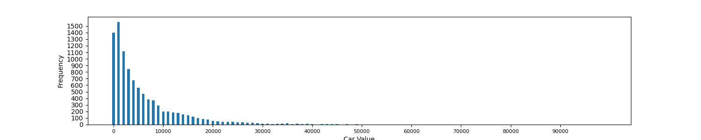
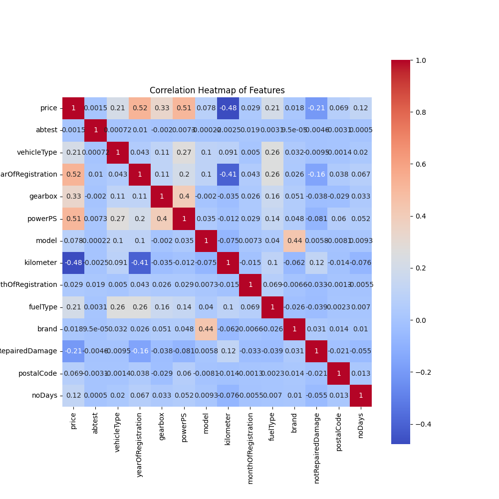
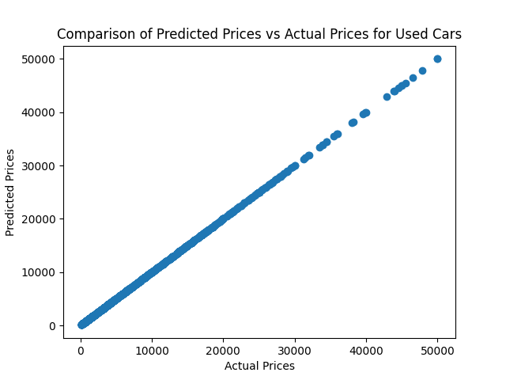

# Used Car Price Prediction

This project aims to determine the price of used cars using various machine learning techniques. It involves exploratory data analysis, including frequency analysis and correlation analysis, followed by the application of multiple machine learning algorithms such as multiple linear regression, neural network, random forest, gradient boost, and XGBoost. The resulting predictions are evaluated based on the root mean squared error (RMSE) values, and visualized using graphs comparing the predictions against the testing data.

## Exploratory Techniques

### Frequency Analysis

Frequency analysis is performed to understand the distribution of car prices in the dataset. The frequency analysis graph provides insights into the range and distribution of car prices, helping us understand the data's price distribution characteristics. The price was found to have a skewness of 3.02 and a kurtosis of 15.13, so a log transform was placed on the price so it would work better with the machine learning techniques.

### Correlation Analysis

Correlation analysis examines the relationships between the car price and other variables in the dataset. It helps identify which features have a significant impact on the price and determine the direction of their relationships (positive or negative correlation). Based on the correlation heat map below, the features abtest, model, monthOfRegistration, brand, and postalCode were removed from consideration. A log transform was placed on all continuous features.

## Machine Learning Techniques

Multiple machine learning techniques are employed to predict the prices of used cars. The following techniques are applied:

- Multiple Linear Regression
- Neural Network
- Random Forest
- Gradient Boost
- XGBoost

To evaluate the performance of these models, the root mean squared error (RMSE) values are calculated. The table below shows the RMSE values obtained for each technique. Based on the RMSE values, XGBoost seems to be the most accurate model and was chosen as the final model.

| Technique          | RMSE       |
|--------------------|------------|
| Multiple Regression| 0.704      |
| Neural Network     | 0.687      |
| Random Forest      | 0.477      |
| Gradient Boost     | 0.470      |
| XGBoost            | 0.464      |

## Predictions

The predictions obtained from each machine learning technique are visualized by comparing them against the testing data. The graph below shows the predicted prices plotted against the actual prices from the testing dataset. Note the linearity of the graph.

## Conclusion

This project employed various exploratory techniques and machine learning algorithms to predict the prices of used cars. The exploratory data analysis provided valuable insights into the distribution of car prices and the relationships between the price and other variables in the dataset.

Multiple machine learning techniques, including multiple linear regression, neural network, random forest, gradient boost, and XGBoost, were applied to predict the prices of the used cars. Each technique was evaluated based on the root mean squared error (RMSE) values, providing an understanding of their performance and accuracy in predicting car prices.

Based on the results, the XGBoost algorithm achieved the lowest RMSE value, demonstrating superior predictive performance compared to the other techniques. This algorithm successfully captured complex relationships and provided more accurate price predictions for used cars.

The visualizations comparing the predictions against the testing data revealed a strong linear relationship. The predicted prices closely aligned with the actual prices, forming a near-perfect diagonal line. This linearity suggests that the models effectively captured the underlying patterns and trends in the data, resulting in accurate price predictions.

The observed linear relationship highlights the effectiveness of the machine learning models in capturing the price dynamics of used cars. The models successfully leveraged the input features to predict the prices, leading to reliable estimations.
